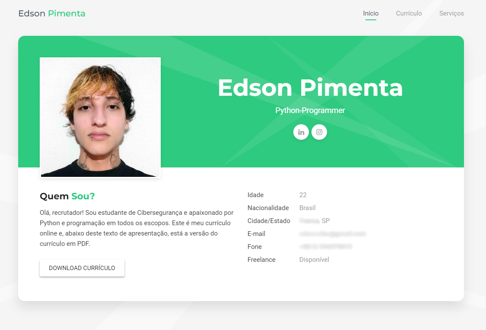
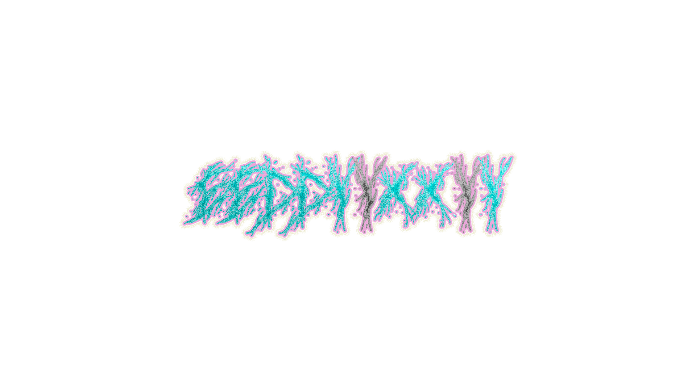

# Meu currículo online
> Feito no curso de Git e GitHub: Essencial, com CSS/HTML/JavaScript

### O curriculo contém projeções pros meus próximos estudos

Como meu **primeiro repositório**, me sinto orgulhoso de tê-lo aqui, compartilhado. Este pequeno projeto foi realizado no curso **Git e GitHub: Essencial** da Geek University.

Finalizando este curso de Git e GitHub (algo provável de acontecer ainda hoje, dia 23 de Agosto de 2022), irei prosseguir meus estudos com os cursos de Django Framework e SQL e NoSQL e, somente então, iniciar meus estudos mais aprofundados com programação assíncrona em Python, Fast APIs com Python e APIs Rest com Django e Python, JavaScript, React, Linux e SQL Alchemy.

---

#### Contato:

[LinkedIn](https://www.linkedin.com/in/eeddyyxxyy/ "Para contato profissional")

[Currículo Online](https://eddyyxxyy.github.io/#home "Realizado no curso de Git e Github: Essencial")

---

